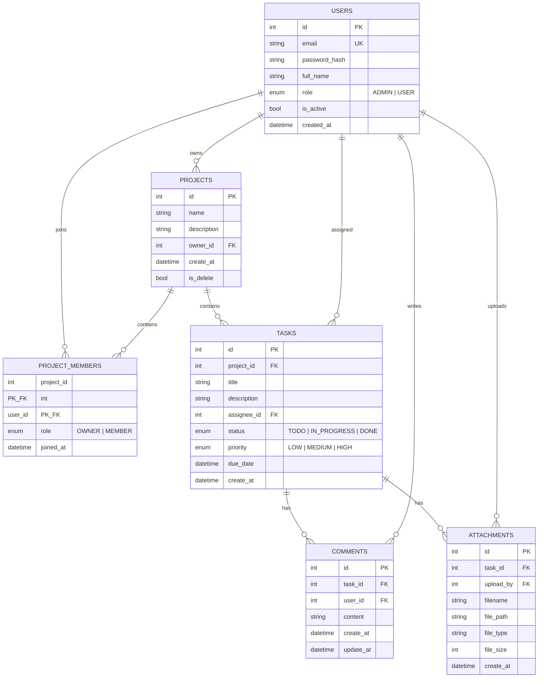

# Team Management API


Backend RESTful API phục vụ quản lý dự án và nhóm làm việc. Ứng dụng cho phép người dùng tạo dự án, quản lý thành viên, giao task, theo dõi trạng thái công việc, bình luận và tải tệp đính kèm.

Dự án được xây dựng bằng **FastAPI**, **SQLAlchemy 2.x**, **Pydantic v2** và xác thực JWT. Mã nguồn ứng dụng nằm trong package `src/project_fastapi`.

## Mục lục

- [Tính năng](#tính-năng)
- [Công nghệ](#công-nghệ)
- [Cấu trúc dự án](#cấu-trúc-dự-án)
- [Mô hình dữ liệu](#mô-hình-dữ-liệu)
- [Cài đặt và chạy](#cài-đặt-và-chạy)
- [Biến môi trường](#biến-môi-trường)
- [Tài liệu API](#tài-liệu-api)
- [Ví dụ gọi API](#ví-dụ-gọi-api)
- [Giấy phép](#giấy-phép)

## Tính năng

- Đăng ký, đăng nhập và làm mới access token bằng JWT.
- Băm mật khẩu bằng Argon2 thông qua `pwdlib`.
- CRUD dự án với quyền sở hữu dự án.
- Thêm, xem và xóa thành viên dự án.
- Tạo, xem, lọc, cập nhật và xóa task.
- Theo dõi trạng thái task: `TODO`, `IN_PROGRESS`, `DONE`.
- Theo dõi mức độ ưu tiên: `LOW`, `MEDIUM`, `HIGH`.
- Bình luận trên task.
- Upload file đính kèm với giới hạn dung lượng, phần mở rộng và MIME type.
- Rate limiting với `slowapi` và middleware ghi log request.
- Chuẩn hóa response thành công và lỗi thông qua schema `StandardResponse`.

## Công nghệ

| Thành phần          | Công nghệ                       |
| --------------------- | --------------------------------- |
| Ngôn ngữ            | Python 3.14+                      |
| Web framework         | FastAPI                           |
| ASGI server           | Uvicorn                           |
| ORM                   | SQLAlchemy 2.x                    |
| Validation/settings   | Pydantic v2,`pydantic-settings` |
| Authentication        | JWT (`PyJWT`)                   |
| Password hashing      | Argon2 (`pwdlib`)               |
| Database driver       | MySQL với`PyMySQL`             |
| Rate limiting         | `slowapi`                       |
| Dependency management | `uv` hoặc `pip`              |

## Cấu trúc dự án

```text
.
├── pyproject.toml
├── requirements.txt
├── README.md
└── src/
		└── project_fastapi/
				├── app/
				│   ├── main.py              # Khởi tạo FastAPI và đăng ký router
				│   ├── core/                # Cấu hình, JWT, logger, rate limiter
				│   ├── db/                  # Engine, session và tạo bảng
				│   ├── dependencies/        # Dependency xác thực và phân quyền
				│   ├── exceptions/           # Exception handlers
				│   ├── models/               # SQLAlchemy models
				│   ├── responses/             # StandardResponse
				│   ├── routers/              # Các endpoint API
				│   ├── schemas/              # Pydantic request/response schemas
				│   ├── services/             # Business logic
				│   ├── Upload/               # Thư mục lưu file upload
				│   └── utils/                # Middleware và tiện ích file
				└── test/                     # Test suite
```

## Mô hình dữ liệu



## Cài đặt và chạy

### Yêu cầu

- Python 3.14 trở lên.
- MySQL đang chạy và một database đã được tạo.
- `uv` hoặc `pip`.

### Cài đặt với `uv`

```bash
uv sync
```

### Cài đặt với `pip`

```bash
python -m venv .venv

# Windows PowerShell
.venv\Scripts\Activate.ps1

# macOS/Linux
source .venv/bin/activate

pip install -r requirements.txt
```

### Chạy ứng dụng

Các lệnh dưới đây được chạy từ thư mục `src/project_fastapi`, nơi đặt file `.env`:

```bash
uv run fastapi dev app/main.py --reload
```

Hoặc:

```bash
uvicorn app.main:app --reload --host localhost --port 3636
```

Ứng dụng mặc định chạy tại `http://localhost:3636`. Khi khởi động, `Base.metadata.create_all()` sẽ tạo các bảng còn thiếu trong database.

## Biến môi trường

Tạo file `src/project_fastapi/.env` dựa trên `.env.example`. Các biến bắt buộc theo `app/core/config.py`:

| Biến                           | Mô tả                                         | Ví dụ                                  |
| ------------------------------- | ----------------------------------------------- | ---------------------------------------- |
| `DATABASE_USER`               | Tài khoản MySQL                               | `root`                                 |
| `DATABASE_PASSWORD`           | Mật khẩu MySQL                                | `change-me`                            |
| `DATABASE_HOST`               | Host MySQL                                      | `127.0.0.1`                            |
| `DATABASE_PORT`               | Cổng MySQL                                     | `3306`                                 |
| `DATABASE_NAME`               | Tên database                                   | `team_project_db`                      |
| `SECRET_KEY`                  | Khóa ký JWT                                   | `change-me`                            |
| `ALGORITHM`                   | Thuật toán JWT                                | `HS256`                                |
| `ACCESS_TOKEN_EXPIRE_MINUTES` | Thời gian sống access token                   | `30`                                   |
| `REFRESH_TOKEN_EXPIRE_DAY`    | Thời gian sống refresh token                  | `7`                                    |
| `CORS_ORIGINS_STR`            | Danh sách origin, phân tách bằng dấu phẩy | `http://localhost:5173`                |
| `MAX_FILE_SIZE_STRING`        | Dung lượng file tối đa, tính theo MB       | `10`                                   |
| `ALLOWED_EXTENSIONS_STRING`   | Phần mở rộng được phép                   | `.pdf,.png,.jpg`                       |
| `ALLOWED_MIME_TYPES_STRING`   | MIME type được phép                         | `application/pdf,image/png,image/jpeg` |
| `UPLOAD_DIR`                  | Thư mục lưu file upload                      | `Upload/attachement`                   |

Không commit file `.env` chứa mật khẩu database hoặc secret key thật vào repository.

## Tài liệu API

Sau khi chạy ứng dụng:

- Swagger UI: [127.0.0.1:8000/docs](http://127.0.0.1:8000/docs)
- ReDoc: 127.0.0.1:8000/redoc
- Health check: `GET http://127.0.0.1:8000/`

### Xác thực

1. Gọi `POST /auth/register` để tạo tài khoản.
2. Gọi `POST /auth/login` để nhận `access_token` và `refresh_token`.
3. Gửi access token trong header:

```text
Authorization: Bearer <access_token>
```

4. Khi access token hết hạn, gọi `POST /auth/refresh` với refresh token trong request body theo schema `RefreshTokenRequest`.

### Danh sách endpoint

#### Authentication - `/auth`

| Method   | Endpoint           | Mô tả                  | Quyền                 |
| -------- | ------------------ | ------------------------ | ---------------------- |
| `POST` | `/auth/register` | Đăng ký tài khoản   | Public                 |
| `POST` | `/auth/login`    | Đăng nhập, cấp token | Public                 |
| `POST` | `/auth/refresh`  | Cấp access token mới   | Refresh token hợp lệ |

#### User - `/user`

| Method  | Endpoint        | Mô tả                                                                 | Quyền     |
| ------- | --------------- | ----------------------------------------------------------------------- | ---------- |
| `GET` | `/user/me`    | Xem thông tin tài khoản hiện tại                                   | User/Admin |
| `GET` | `/user/users` | Tìm kiếm danh sách người dùng theo tên, email hoặc trạng thái | Admin      |

#### Project - `/projects`

| Method     | Endpoint                   | Mô tả                                                   | Quyền               |
| ---------- | -------------------------- | --------------------------------------------------------- | -------------------- |
| `POST`   | `/projects/`             | Tạo dự án, người tạo trở thành owner              | User/Admin           |
| `GET`    | `/projects/`             | Liệt kê dự án của người dùng, hỗ trợ`keyword` | Đã đăng nhập    |
| `GET`    | `/projects/{project_id}` | Xem chi tiết dự án                                     | Thành viên dự án |
| `PATCH`  | `/projects/{project_id}` | Cập nhật dự án                                        | Owner                |
| `DELETE` | `/projects/{project_id}` | Xóa mềm dự án                                         | Owner                |

#### Project members - `/project_member`

| Method     | Endpoint                            | Mô tả                     | Quyền               |
| ---------- | ----------------------------------- | --------------------------- | -------------------- |
| `POST`   | `/project/{id}/members`           | Thêm thành viên          | Owner                |
| `GET`    | `/project/{id}/members`           | Xem danh sách thành viên | Thành viên dự án |
| `DELETE` | `/project/{id}/members/{user_id}` | Xóa thành viên           | Owner                |

#### Tasks, comments và attachments - `/task`

| Method     | Endpoint                              | Mô tả                                                                                                          | Quyền               |
| ---------- | ------------------------------------- | ---------------------------------------------------------------------------------------------------------------- | -------------------- |
| `POST`   | `/task/projects/{id}/task`          | Tạo task trong dự án                                                                                          | Thành viên dự án |
| `GET`    | `/task/projects/{project_id}/tasks` | Liệt kê task và lọc theo`statu`, `priority`, `assignee`, `title`, `limit`, `offset`, `sort_by` | Thành viên dự án |
| `GET`    | `/task/tasks/{task_id}`             | Xem chi tiết task                                                                                               | Thành viên dự án |
| `PATCH`  | `/task/tasks/{task_id}`             | Cập nhật task                                                                                                  | Thành viên dự án |
| `DELETE` | `/task/{task_id}`                   | Xóa mềm task                                                                                                   | Thành viên dự án |
| `POST`   | `/task/{task_id}/comments`          | Thêm bình luận                                                                                                | Theo sự cho phép   |
| `POST`   | `/task/{task_id}/attachments`       | Upload file multipart                                                                                            | Theo sự cho phép   |

### Định dạng response

Response thành công thường có dạng:

```json
{
	"StatusCode": 200,
	"Message": "Thành công",
	"Error": null,
	"Data": {},
	"TimeStamp": "2026-01-01T00:00:00Z",
	"Path": "/projects/"
}
```

Các lỗi HTTP được xử lý tập trung và trả về thông tin `StatusCode`, `Message`, `Error`, `Data` và `Path` tương ứng.

## Ví dụ gọi API

### Đăng ký

```bash
curl -X POST http://localhost:3636/auth/register \
	-H "Content-Type: application/json" \
	-d '{
		"email": "manager@example.com",
		"password": "StrongPassword123",
		"full_name": "Nguyen Van A",
		"created_at": "2026-08-24T10:00:00Z"
	}'
```

### Đăng nhập

```bash
curl -X POST http://localhost:3636/auth/login \
	-H "Content-Type: application/json" \
	-d '{
		"email": "manager@example.com",
		"password": "StrongPassword123"
	}'
```

### Tạo dự án

```bash
curl -X POST http://localhost:3636/projects/ \
	-H "Authorization: Bearer <access_token>" \
	-H "Content-Type: application/json" \
	-d '{
		"name": "Riverside Tower",
		"description": "Dự án quản lý đội nhóm",
		"create_at": "2026-08-24T10:00:00Z"
	}'
```

### Tạo task

```bash
curl -X POST http://localhost:3636/task/projects/1/task \
	-H "Authorization: Bearer <access_token>" \
	-H "Content-Type: application/json" \
	-d '{
		"title": "Hoàn thiện API đăng nhập",
		"description": "Kiểm tra access token và refresh token",
		"assignee_id": 2,
		"status": "TODO",
		"priority": "HIGH",
		"due_date": "2026-09-01T10:00:00Z",
		"create_at": "2026-08-24T10:00:00Z"
	}'
```

### Upload file đính kèm

```bash
curl -X POST http://localhost:3636/task/1/attachments \
	-H "Authorization: Bearer <access_token>" \
	-F "upload_file_in=@/path/to/document.pdf"
```

## Giấy phép

MIT

## Tác giả

- Demon :) - `siuotp@gmail.com` mở với code
  '''text
⠀⠀⠀⠀⠀⠀⠀⠀⠀⠀⠈⠉⠛⠛⠛⢿⠙⠃⠠⢄⠀⠀⣚⣿⣷⣦⠹⢨⠀⠀⠄⠀⠀⠀⠀⠀⠀⠈⠀⠁⠀⢀⠁⠀⠀⢰⠀⠂⠄⠁⠀⠀⠀⠀⠀⠀⠀⠀⠀⠀⡀⠀⠀⠀⠀⠇⠁⠙⠀⠉⠙⠋⠀⠀⠀⠀⠀⠀⠀⠀⠀⠀⠀⠀⠀⠀⠀⠀⠀⠀⠀
⠀⠀⠀⠀⠀⠀⠀⠀⠀⠀⠀⠀⠀⠀⠀⠀⠀⠀⠀⠈⠁⠈⠉⠁⠉⠉⠀⠈⠀⠒⠷⠄⠠⠐⠀⠀⠀⠀⠀⠀⠀⠀⠀⠀⢀⠘⠓⠀⠀⠀⠀⠀⠐⠀⢀⠀⠂⠰⠂⠀⠀⠀⠀⠀⠀⠀⠀⠀⠀⠀⠀⠀⠀⠀⠀⠀⠀⠀⠀⠀⠀⠀⠀⠀⣀⣀⣀⣀⠀⠀⢀
⣶⡀⣶⣶⣶⣦⣤⣤⣤⣤⣤⣤⣤⣤⣤⣤⣤⡄⠠⡄⠀⠀⠀⠀⠀⠀⠀⠀⠀⠀⠀⣠⣤⡄⠀⠀⠀⠀⠀⠀⠀⠀⠀⠀⠀⠀⠀⠀⠀⠀⠀⠀⠀⠀⠀⠀⠀⠀⠀⠀⠀⠀⠀⢀⣶⣶⣶⣶⣶⠂⣰⣾⣿⣿⣿⣿⣿⣿⣿⣿⣿⣿⣿⣿⣿⣿⣿⡟⠀⣀⣿
⣿⣧⠸⣿⣿⣿⣿⣿⣿⣿⣿⣿⣿⣿⣿⣿⣿⣿⡀⠿⠿⠦⠀⠀⠀⠀⠀⠀⠀⠀⠺⠿⠇⠀⣷⠆⠀⠀⠀⠀⠀⠀⠀⢀⡀⠀⠀⠀⠀⠀⠀⠀⠀⠀⠀⠀⠀⠀⠀⠀⠀⠀⠈⠉⠉⠙⠛⠛⠋⠐⠛⠿⠿⠿⠿⢿⣿⣿⣿⣿⣿⣿⣿⣿⣿⣿⣿⠁⡟⣿⣿
⣿⣿⡖⠻⠿⠿⠿⠛⠛⠛⠛⠋⠉⠉⠉⠀⠀⠀⠀⠀⠀⠀⠀⠀⠀⠀⠀⠀⠀⠀⠀⠀⠘⠈⠀⠀⠀⠀⠀⠀⠀⠀⠀⠀⠀⠀⠀⠀⠀⠀⠀⠀⠀⠀⠀⠀⠀⠀⠀⠀⠀⠀⠀⠀⠀⠀⠀⠀⠀⠀⠀⠀⠀⠀⠀⠀⠀⠀⠀⠀⠉⠉⠉⠉⠛⠛⠃⠐⠰⠿⠿
⣥⣴⣶⣶⣶⣶⣿⣷⣿⣷⣷⣷⣨⣽⣯⣝⣤⣄⡀⠀⠀⠀⠀⠀⠀⠀⠀⠀⠀⠀⠀⠀⠀⠀⠀⠀⠀⠀⠀⠀⠀⠀⠀⠀⠀⣀⠀⠀⠀⠀⠀⠀⠀⠀⠀⠀⠀⠀⠀⠀⠀⠀⠀⠀⠀⠀⠀⠀⠀⠀⠀⠀⠀⠀⠀⠀⠀⠀⠀⠀⠀⠀⡀⢀⣤⣤⣴⣶⢶⢶⢶
⣿⣿⣿⣿⣿⣿⣿⣿⣿⣿⣿⣿⣿⣿⣿⣿⣿⣯⣷⣤⣭⣤⣶⣤⣴⣶⣲⣆⠀⠀⠀⠀⠀⠀⠀⠀⢠⡀⠀⠀⠀⠀⠀⠀⠊⠀⠀⠀⠀⠀⠀⠀⠀⠀⠀⠀⠀⠀⠀⢰⣲⣾⣳⠷⣟⠷⣶⣶⣦⢬⣥⣄⣀⣀⣄⣠⣤⣶⣾⣷⣶⣿⣿⣿⣿⣿⣯⣿⣿⣿⣿
⣿⣿⣿⣿⣿⠿⠿⠛⣛⡉⢽⣿⣿⣿⣿⣿⣿⣿⣿⣿⣿⠛⠿⣿⣿⣿⣿⡿⠆⠀⣀⣀⣀⡀⠀⠀⠉⠉⠉⠀⠀⠀⠀⠀⠀⠀⠀⠀⠀⠀⠀⠀⠀⠀⠀⢀⣀⠀⠀⠙⣻⣿⣿⣴⣿⣶⣿⣿⣿⣶⣿⣾⣿⣿⣿⣿⣿⣯⠉⠭⢉⡙⠛⠿⠿⣿⣿⣿⣿⣿⣿
⣿⣿⣿⠧⠒⣒⣩⣭⣴⣶⣿⣿⣿⣿⣿⣿⣿⣿⣿⣿⣿⠀⣶⣬⣙⣛⣉⢠⡶⠴⠾⠟⠉⢀⣠⣾⣿⣿⣿⣿⣷⡶⠀⠀⢀⡆⣶⣶⣶⣶⣶⣶⣶⣶⡌⠋⢿⣆⣳⡀⠹⣿⡿⠿⠟⠛⠻⣿⣿⣿⣿⣿⣿⣿⣿⣿⣿⣿⣿⣷⣶⣤⣬⣀⣂⡀⠈⠉⡙⣙⠻
⣽⣿⣿⣿⣿⣿⣿⣿⣿⣿⣿⣿⣿⡟⢹⣿⣿⣿⣿⣿⠇⠀⠈⢻⡿⠟⠳⢚⣁⠛⠀⢀⣤⣾⣿⣿⣿⣿⡿⣿⠋⠀⣶⣾⢸⡇⣿⣿⣿⣿⣿⣿⣿⣿⣿⣆⠛⠻⠿⠇⢀⣤⣶⣶⣶⣾⠗⠈⣿⣿⣿⣿⣿⠉⢿⣿⣿⣿⣿⣿⣿⣿⣿⣿⣿⣿⣿⣶⣶⣤⣍
⣿⣿⣿⣿⣿⣿⣿⣿⣿⣿⡿⠟⣩⣍⡈⠻⠿⠿⠟⣁⠲⣇⣰⣶⣶⣆⠉⠻⠟⠉⠀⣸⣿⣿⣿⣿⣿⠏⡠⠀⠖⣾⠛⣿⢸⡇⢿⣿⣿⣿⣿⣿⣿⣿⣿⣿⣷⣄⠀⣾⣿⣼⣿⣿⣿⠟⣀⣠⣤⣄⣉⡛⠿⣾⣿⣿⣿⣿⣿⣿⣿⣿⣿⣿⣿⣿⣿⣿⣿⣿⣿
⣿⣿⣿⣿⣿⣿⣿⡿⠿⠏⣐⣏⡑⢾⣿⣿⣶⣷⣾⣿⣖⣧⡀⣛⣿⡏⠈⢂⣀⣶⣾⣿⣿⣿⣿⣿⠟⣰⠁⠒⢂⣸⣟⡼⢸⣧⢸⣿⣿⣿⣿⣿⣿⣿⣿⣿⣿⣿⣦⡀⠉⡹⣧⢹⣿⣿⣿⣿⣿⣿⣧⣾⣶⡄⠙⣿⣿⠿⢛⠛⢿⣿⣿⣿⣿⣿⣿⣿⣿⣿⣿
⣿⣿⣿⣿⣿⣿⡟⣰⣾⣿⣿⣿⣿⣿⣿⣿⣿⣿⣿⣿⣿⣿⡿⠸⠟⠁⣠⣾⣿⣿⣿⣿⣿⣿⣿⡏⣼⠁⣾⣄⠙⢿⣿⡇⢸⣿⢸⣿⣿⣿⣿⣿⣿⣿⣿⣿⣿⣿⣿⣿⣦⣅⠌⣠⣙⠻⣿⣿⣿⣿⠛⣿⣿⣧⣤⣭⣰⣾⣿⣿⡀⢿⣿⣿⣿⣿⣿⣿⣿⣿⣿
⣿⣿⣿⣿⣿⣿⣧⢹⣿⣿⣿⣿⣿⣿⣿⣿⣿⡯⣙⡛⠿⢋⡴⠀⣴⣿⣿⣿⣿⣿⣿⣿⣿⡟⠉⠃⢹⡀⠿⠙⠀⠘⣿⡇⣾⣿⢸⣿⣿⣿⣿⣿⣿⣿⣿⣿⣿⣿⣿⣿⣿⣿⣆⠉⠿⣧⢸⣿⣿⣿⣿⣿⣿⣧⣀⣽⣿⣿⣿⣿⣿⡄⠙⣿⣿⣿⣿⣿⣿⣿⣿
⣿⣿⣿⡿⠿⠿⠟⣈⣿⣿⣿⣿⡿⢻⣿⡿⠋⠴⣿⣿⡦⠀⢀⣼⣿⣿⣿⣿⣿⣿⣿⣧⣄⢰⣿⡆⠙⢿⣶⠶⢿⣦⠈⠃⣿⣿⠀⣿⣿⣿⣿⣿⣿⣿⣿⣿⣿⣿⣿⣿⣿⣿⣿⣷⣄⡘⠈⠻⣿⣿⡟⠉⣿⣿⣿⣿⣿⣿⣿⣿⣿⣿⡆⠘⠙⣿⣿⣿⣿⣿⣿
⣿⣩⣴⣾⣿⣾⣿⣿⣿⣿⣿⣿⣷⣄⢀⡀⢤⡤⠋⣁⣤⣶⣾⣿⣿⣿⣿⣿⣿⣿⣿⣿⣿⠆⠹⣇⢨⣀⢹⠆⢀⣀⣤⠆⣿⣿⡇⣿⣿⣿⣿⣿⣿⣿⣿⣿⣿⣿⣿⣿⣿⣿⣿⣿⣿⣿⣦⣑⠈⠁⡀⣴⣿⣿⣿⣿⣿⣿⣿⣿⣿⣿⣄⠘⢿⣿⣿⣿⣿⣿⣿
⣿⣿⣿⡿⣿⣿⣿⣿⣿⣿⣿⣿⡟⣡⠟⣋⠄⠀⣴⣿⣿⣿⣿⣿⣿⣿⣿⣿⣿⣿⣿⡟⣡⣤⣀⠈⠓⠻⡾⠃⠀⣹⣿⡆⣿⣿⡇⣿⣿⣿⣿⣿⣿⣿⣿⣿⣿⣿⣿⣿⣿⣿⣿⣿⣿⣿⣿⣿⡀⠀⢻⣦⡙⢿⣿⣿⣿⣿⣿⣿⣿⣿⣿⣆⠸⠿⠋⠻⡿⢿⣿
⣿⣿⣿⣿⣿⣿⣿⣿⣿⣿⡿⢋⣴⠏⠀⣠⣶⣿⣿⣿⣿⣿⣿⣿⣿⣿⣿⣿⣿⣿⣿⢰⣿⣿⣿⣏⠲⣤⠀⣴⣿⣿⣿⠀⣿⣿⡇⢿⣿⣿⣿⣿⣿⣿⣿⣿⣿⣿⣿⣿⣿⣿⣿⣿⣿⣿⣿⣿⣿⣷⣌⠁⠹⣌⠻⢿⣿⣿⣿⡉⠠⣴⣤⣄⠲⠚⢷⣶⣶⣿⣏
⣿⣿⣿⣿⣿⣿⣿⣿⣿⣿⣿⠟⠋⣠⣿⣿⣿⣿⣿⣿⣿⣿⣿⣿⣿⣿⣿⣿⣿⣿⣿⠘⣻⣿⣿⣿⣰⡏⠀⣿⣿⣿⣿⢠⣿⣿⡇⢸⣿⣿⣿⣿⣿⣿⣿⣿⣿⣿⣿⣿⣿⣿⣿⣿⣿⣿⣿⣿⣿⣿⣿⣦⣀⠙⢸⣌⢻⣿⣿⣿⣷⣶⣶⣦⣥⣶⡿⣿⣿⣿⣿
⣿⣿⣿⣿⣿⣿⣿⣿⣿⣿⠏⢠⣾⣿⣿⣿⣿⣿⣿⣿⣿⣿⣿⣿⣿⣿⣿⣿⣿⣿⡏⣴⣿⡟⢉⠉⠈⠀⣾⣿⣿⣿⣿⢸⣿⣿⣿⢸⣿⣿⣿⣿⣿⣿⣿⣿⣿⣿⣿⣿⣿⣿⣿⣿⣿⣿⣿⣿⣿⣿⣿⣿⣿⣧⡘⣿⣦⡙⠿⢿⣿⣿⣿⣿⣿⡋⢁⣉⣙⣻⠻
⣿⣿⣿⣿⣿⣿⣿⣿⠟⢁⣴⣿⣿⣿⣿⣿⣿⣿⣿⣿⣿⣿⣿⣿⣿⣿⣿⣿⣿⣿⠃⣿⣿⣷⡀⡀⠉⣿⣿⣿⣿⣿⣿⢸⣿⣿⣿⢸⣿⣿⣿⣿⣿⣿⣿⣿⣿⣿⣿⣿⣿⣿⣿⣿⣿⣿⣿⣿⣿⣿⣿⣿⣿⣿⣷⡘⢿⣿⣿⣆⠹⢿⣿⣿⣿⣷⡘⢿⣿⣿⣿
⣿⣿⣿⣿⣿⣿⡿⠁⣰⣿⣿⣿⣿⣿⣿⣿⣿⣿⣿⣿⣿⣿⣿⣿⣿⣿⣿⣿⡿⢡⣾⣿⣿⣿⡇⡇⢸⣿⣿⣿⣿⣿⣿⢸⣿⣿⣿⢸⣿⣿⣿⣿⣿⣿⣿⣿⣿⣿⣿⣿⣿⣿⣿⣿⣿⣿⣿⣿⣿⣿⣿⣿⣿⣿⣿⣷⣄⠀⣿⣿⠃⠀⠙⠛⠛⠛⠛⠀⠙⠛⣿
⣿⣿⣿⣿⡿⠋⣠⣾⣿⣿⣿⣿⣿⣿⣿⣿⣿⣿⣿⣿⣿⣿⣿⣿⣿⣿⣿⡏⣰⣿⣿⣿⣟⣿⣿⠃⣘⣿⣿⣿⣿⣿⣿⣾⣿⣿⣿⠈⣿⣿⣿⣿⣿⣿⣿⣿⣿⣿⣿⣿⣿⣿⣿⣿⣿⣿⣿⣿⣿⣿⣿⣿⣿⣿⣿⣿⣿⣆⠙⢿⣷⣤⣴⣤⣤⣶⣶⣶⣶⣶⣿